# [📈 Live Status](https://upptime.github.io/upptime): <!--live status--> **🟧 Partial outage**

<!--start: status pages-->
<!-- This summary is generated by Upptime (https://github.com/upptime/upptime) -->
<!-- Do not edit this manually, your changes will be overwritten -->
<!-- prettier-ignore -->
| URL | Status | History | Response Time | Uptime |
| --- | ------ | ------- | ------------- | ------ |
|  [joelee.works](https://joelee.works) | 🟩 Up | [joelee-works.yml](https://github.com/iamsurgee/uptime/commits/HEAD/history/joelee-works.yml) | 

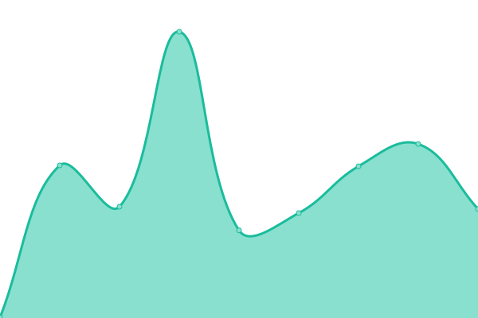 271ms
     
 | 

<a href="https://iamsurgee.github.io/uptime/history/joelee-works">100.00%</a>
    

|  [Github Player](https://music.joelee.works) | 🟩 Up | [github-player.yml](https://github.com/iamsurgee/uptime/commits/HEAD/history/github-player.yml) | 

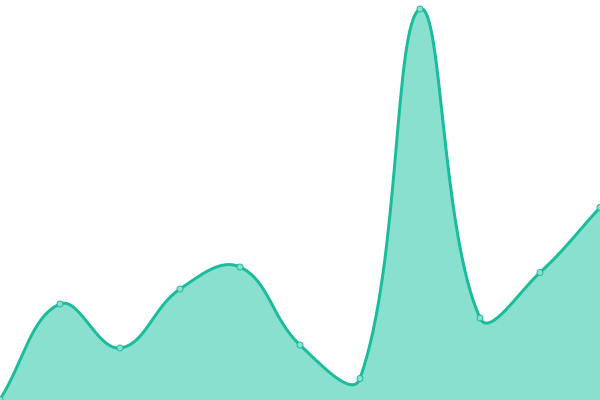 214ms
     
 | 

<a href="https://iamsurgee.github.io/uptime/history/github-player">100.00%</a>
    

|  [Jet Brawley](https://cruelajarevents--leecheeyong.repl.co/) | 🟩 Up | [jet-brawley.yml](https://github.com/iamsurgee/uptime/commits/HEAD/history/jet-brawley.yml) | 

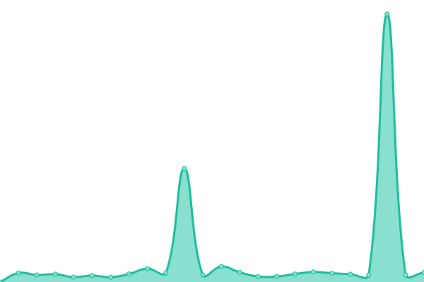 1596ms
     
 | 

<a href="https://iamsurgee.github.io/uptime/history/jet-brawley">99.63%</a>
    

|  [Music](https://music.is-a.dev) | 🟩 Up | [music.yml](https://github.com/iamsurgee/uptime/commits/HEAD/history/music.yml) | 

 418ms
     
 | 

<a href="https://iamsurgee.github.io/uptime/history/music">88.35%</a>
    

|  [One Time Msg](https://onemsg.js.org/) | 🟥 Down | [one-time-msg.yml](https://github.com/iamsurgee/uptime/commits/HEAD/history/one-time-msg.yml) | 

 517ms
     
 | 

<a href="https://iamsurgee.github.io/uptime/history/one-time-msg">99.70%</a>
    

|  [GeoIP](https://geoip.bsyou.repl.co/) | 🟥 Down | [geo-ip.yml](https://github.com/iamsurgee/uptime/commits/HEAD/history/geo-ip.yml) | 

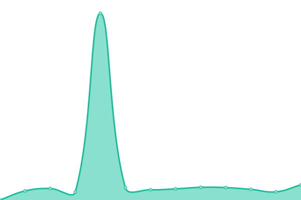 4490ms
     
 | 

<a href="https://iamsurgee.github.io/uptime/history/geo-ip">98.52%</a>
    

|  [Terminal Bot](https://terminal.bsyou.repl.co/) | 🟥 Down | [terminal-bot.yml](https://github.com/iamsurgee/uptime/commits/HEAD/history/terminal-bot.yml) | 

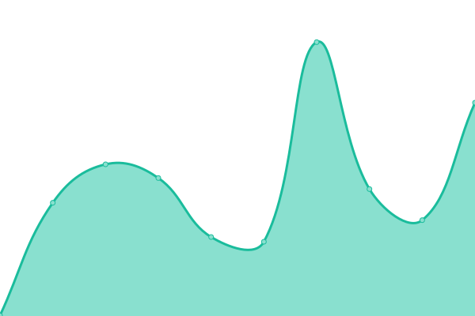 478ms
     
 | 

<a href="https://iamsurgee.github.io/uptime/history/terminal-bot">99.39%</a>
    

|  [Joe Bot](https://oddballnuttynumericalanalysis--cjyou.repl.co/) | 🟥 Down | [joe-bot.yml](https://github.com/iamsurgee/uptime/commits/HEAD/history/joe-bot.yml) | 

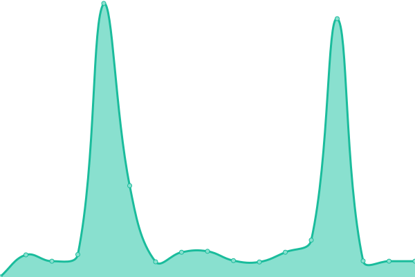 2118ms
     
 | 

<a href="https://iamsurgee.github.io/uptime/history/joe-bot">99.15%</a>
    

|  [Garden API](https://garden.is-a.dev) | 🟩 Up | [garden-api.yml](https://github.com/iamsurgee/uptime/commits/HEAD/history/garden-api.yml) | 

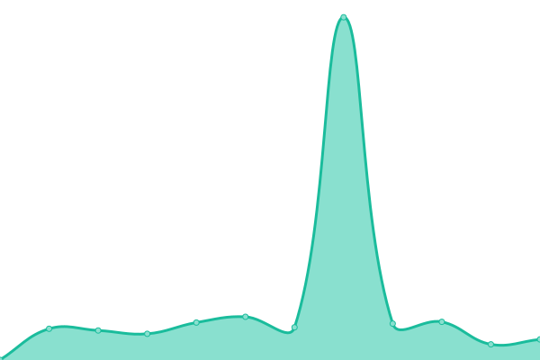 435ms
     
 | 

<a href="https://iamsurgee.github.io/uptime/history/garden-api">99.81%</a>
    

|  [NewsPool](https://newspool.js.org) | 🟥 Down | [news-pool.yml](https://github.com/iamsurgee/uptime/commits/HEAD/history/news-pool.yml) | 

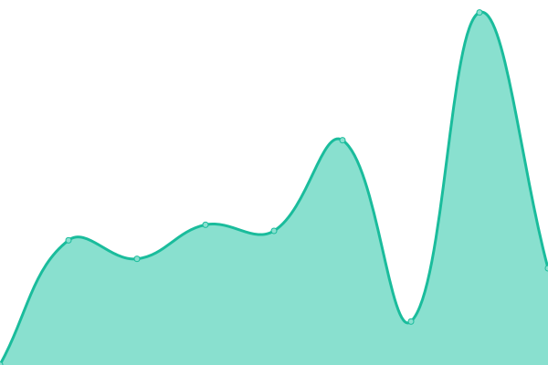 3536ms
     
 | 

<a href="https://iamsurgee.github.io/uptime/history/news-pool">99.15%</a>
    

|  [Linky](https://UnrealisticGrimVolcano-1.redirector.repl.co) | 🟥 Down | [linky.yml](https://github.com/iamsurgee/uptime/commits/HEAD/history/linky.yml) | 

 8456ms
     
 | 

<a href="https://iamsurgee.github.io/uptime/history/linky">96.15%</a>
    

|  [Shortem](https://short.is-a.dev) | 🟥 Down | [shortem.yml](https://github.com/iamsurgee/uptime/commits/HEAD/history/shortem.yml) | 

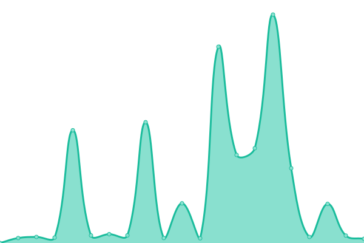 5677ms
     
 | 

<a href="https://iamsurgee.github.io/uptime/history/shortem">99.19%</a>
    

|  [Hello](https://hello.is-a.dev) | 🟩 Up | [hello.yml](https://github.com/iamsurgee/uptime/commits/HEAD/history/hello.yml) | 

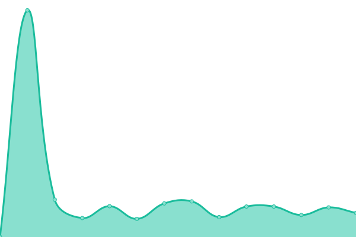 2543ms
     
 | 

<a href="https://iamsurgee.github.io/uptime/history/hello">99.14%</a>
    

|  [Inky](https://ink.is-a.dev/test) | 🟩 Up | [inky.yml](https://github.com/iamsurgee/uptime/commits/HEAD/history/inky.yml) | 

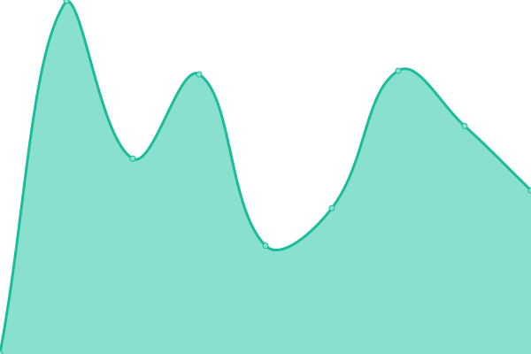 1026ms
     
 | 

<a href="https://iamsurgee.github.io/uptime/history/inky">98.59%</a>
    

|  [Status](https://UnsteadyBitterPoints.noiceapi.repl.co) | 🟩 Up | [status.yml](https://github.com/iamsurgee/uptime/commits/HEAD/history/status.yml) | 

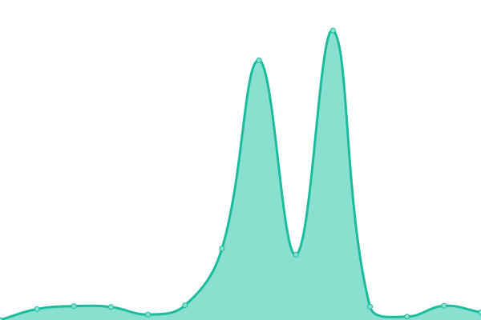 2991ms
     
 | 

<a href="https://iamsurgee.github.io/uptime/history/status">62.76%</a>
    

|  [Uptime](https://rudedarkbluehacks.modm.repl.co/) | 🟥 Down | [uptime.yml](https://github.com/iamsurgee/uptime/commits/HEAD/history/uptime.yml) | 

 1471ms
     
 | 

<a href="https://iamsurgee.github.io/uptime/history/uptime">99.87%</a>
    

|  [Modmail](https://profitablecoordinatedmacroinstruction.modm.repl.co/) | 🟥 Down | [modmail.yml](https://github.com/iamsurgee/uptime/commits/HEAD/history/modmail.yml) | 

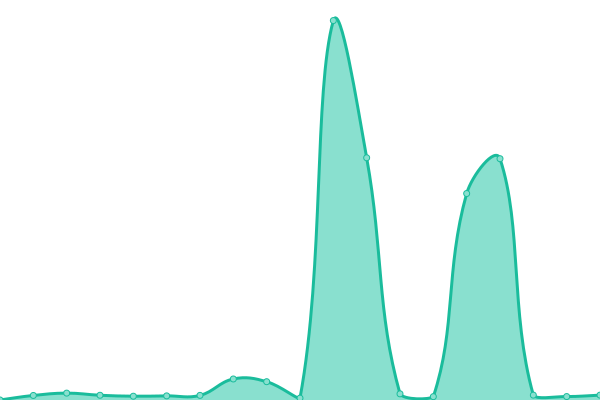 678ms
     
 | 

<a href="https://iamsurgee.github.io/uptime/history/modmail">97.74%</a>
    

|  [Note](https://NiceSubduedDevices.modm.repl.co) | 🟥 Down | [note.yml](https://github.com/iamsurgee/uptime/commits/HEAD/history/note.yml) | 

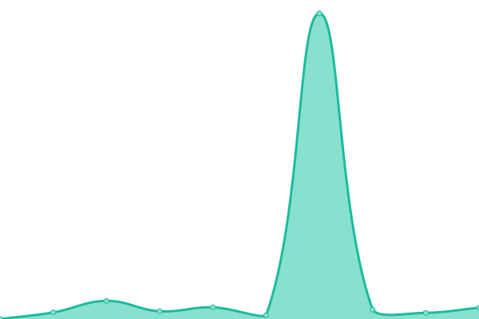 3832ms
     
 | 

<a href="https://iamsurgee.github.io/uptime/history/note">95.93%</a>
    

|  [NewsPool Bot](https://newspool-bot.craigcodes.repl.co) | 🟥 Down | [news-pool-bot.yml](https://github.com/iamsurgee/uptime/commits/HEAD/history/news-pool-bot.yml) | 

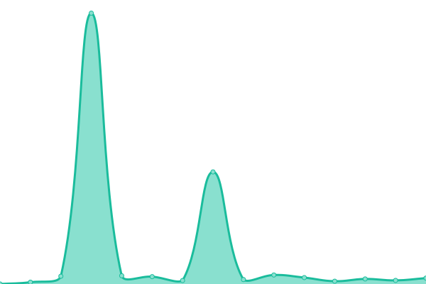 4033ms
     
 | 

<a href="https://iamsurgee.github.io/uptime/history/news-pool-bot">98.74%</a>
    

|  [Badminton](https://badminton.leecheeyong.repl.co) | 🟩 Up | [badminton.yml](https://github.com/iamsurgee/uptime/commits/HEAD/history/badminton.yml) | 

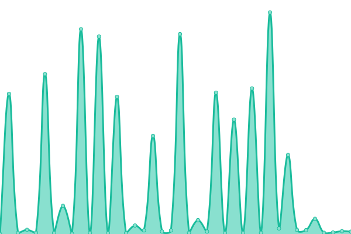 4160ms
     
 | 

<a href="https://iamsurgee.github.io/uptime/history/badminton">97.56%</a>
    

|  [Test Project](https://badminton.teambrawley.repl.co) | 🟥 Down | [test-project.yml](https://github.com/iamsurgee/uptime/commits/HEAD/history/test-project.yml) | 

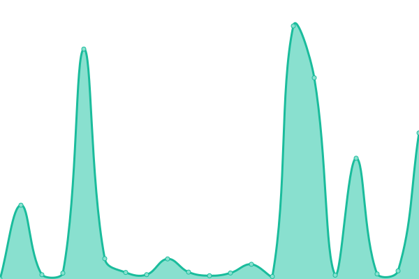 1335ms
     
 | 

<a href="https://iamsurgee.github.io/uptime/history/test-project">99.28%</a>
    

<!--end: status pages-->

[**Visit our status website →**](https://upptime.github.io/upptime)
