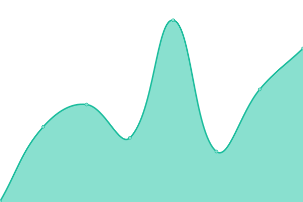

# [📈 Live Status](https://upptime.github.io/upptime): <!--live status--> **🟩 All systems operational**

<!--start: status pages-->
<!-- This summary is generated by Upptime (https://github.com/upptime/upptime) -->
<!-- Do not edit this manually, your changes will be overwritten -->
<!-- prettier-ignore -->
| URL | Status | History | Response Time | Uptime |
| --- | ------ | ------- | ------------- | ------ |
|  [joelee.works](https://joelee.works) | 🟩 Up | [joelee-works.yml](https://github.com/iamsurgee/uptime/commits/HEAD/history/joelee-works.yml) | 

 268ms
     
 | 

<a href="https://iamsurgee.github.io/uptime/history/joelee-works">100.00%</a>
    

|  [Github Player](https://music.joelee.works) | 🟩 Up | [github-player.yml](https://github.com/iamsurgee/uptime/commits/HEAD/history/github-player.yml) | 

 212ms
     
 | 

<a href="https://iamsurgee.github.io/uptime/history/github-player">100.00%</a>
    

|  [Jet Brawley](https://cruelajarevents--leecheeyong.repl.co/) | 🟩 Up | [jet-brawley.yml](https://github.com/iamsurgee/uptime/commits/HEAD/history/jet-brawley.yml) | 

 1424ms
     
 | 

<a href="https://iamsurgee.github.io/uptime/history/jet-brawley">98.97%</a>
    

|  [Music](https://music.is-a.dev) | 🟩 Up | [music.yml](https://github.com/iamsurgee/uptime/commits/HEAD/history/music.yml) | 

 409ms
     
 | 

<a href="https://iamsurgee.github.io/uptime/history/music">87.79%</a>
    

|  [One Time Msg](https://onemsg.js.org/) | 🟩 Up | [one-time-msg.yml](https://github.com/iamsurgee/uptime/commits/HEAD/history/one-time-msg.yml) | 

 1438ms
     
 | 

<a href="https://iamsurgee.github.io/uptime/history/one-time-msg">98.93%</a>
    

|  [GeoIP](https://geoip.bsyou.repl.co/) | 🟩 Up | [geo-ip.yml](https://github.com/iamsurgee/uptime/commits/HEAD/history/geo-ip.yml) | 

 5641ms
     
 | 

<a href="https://iamsurgee.github.io/uptime/history/geo-ip">97.64%</a>
    

|  [Terminal Bot](https://terminal.bsyou.repl.co/) | 🟩 Up | [terminal-bot.yml](https://github.com/iamsurgee/uptime/commits/HEAD/history/terminal-bot.yml) | 

 1162ms
     
 | 

<a href="https://iamsurgee.github.io/uptime/history/terminal-bot">98.46%</a>
    

|  [Joe Bot](https://oddballnuttynumericalanalysis--cjyou.repl.co/) | 🟩 Up | [joe-bot.yml](https://github.com/iamsurgee/uptime/commits/HEAD/history/joe-bot.yml) | 

 2953ms
     
 | 

<a href="https://iamsurgee.github.io/uptime/history/joe-bot">98.61%</a>
    

|  [Garden API](https://garden.is-a.dev) | 🟩 Up | [garden-api.yml](https://github.com/iamsurgee/uptime/commits/HEAD/history/garden-api.yml) | 

 2127ms
     
 | 

<a href="https://iamsurgee.github.io/uptime/history/garden-api">99.69%</a>
    

|  [NewsPool](https://newspool.js.org) | 🟩 Up | [news-pool.yml](https://github.com/iamsurgee/uptime/commits/HEAD/history/news-pool.yml) | 

 4157ms
     
 | 

<a href="https://iamsurgee.github.io/uptime/history/news-pool">98.81%</a>
    

|  [Linky](https://UnrealisticGrimVolcano-1.redirector.repl.co) | 🟩 Up | [linky.yml](https://github.com/iamsurgee/uptime/commits/HEAD/history/linky.yml) | 

 8730ms
     
 | 

<a href="https://iamsurgee.github.io/uptime/history/linky">94.91%</a>
    

|  [Shortem](https://short.is-a.dev) | 🟩 Up | [shortem.yml](https://github.com/iamsurgee/uptime/commits/HEAD/history/shortem.yml) | 

 4278ms
     
 | 

<a href="https://iamsurgee.github.io/uptime/history/shortem">98.63%</a>
    

|  [Hello](https://hello.is-a.dev) | 🟩 Up | [hello.yml](https://github.com/iamsurgee/uptime/commits/HEAD/history/hello.yml) | 

 3186ms
     
 | 

<a href="https://iamsurgee.github.io/uptime/history/hello">99.04%</a>
    

|  [Inky](https://ink.is-a.dev/test) | 🟩 Up | [inky.yml](https://github.com/iamsurgee/uptime/commits/HEAD/history/inky.yml) | 

 1452ms
     
 | 

<a href="https://iamsurgee.github.io/uptime/history/inky">97.90%</a>
    

|  [Status](https://UnsteadyBitterPoints.noiceapi.repl.co) | 🟩 Up | [status.yml](https://github.com/iamsurgee/uptime/commits/HEAD/history/status.yml) | 

 4145ms
     
 | 

<a href="https://iamsurgee.github.io/uptime/history/status">50.93%</a>
    

|  [Uptime](https://rudedarkbluehacks.modm.repl.co/) | 🟩 Up | [uptime.yml](https://github.com/iamsurgee/uptime/commits/HEAD/history/uptime.yml) | 

 1276ms
     
 | 

<a href="https://iamsurgee.github.io/uptime/history/uptime">99.03%</a>
    

|  [Modmail](https://profitablecoordinatedmacroinstruction.modm.repl.co/) | 🟩 Up | [modmail.yml](https://github.com/iamsurgee/uptime/commits/HEAD/history/modmail.yml) | 

 2382ms
     
 | 

<a href="https://iamsurgee.github.io/uptime/history/modmail">97.16%</a>
    

|  [Note](https://NiceSubduedDevices.modm.repl.co) | 🟩 Up | [note.yml](https://github.com/iamsurgee/uptime/commits/HEAD/history/note.yml) | 

 3917ms
     
 | 

<a href="https://iamsurgee.github.io/uptime/history/note">95.24%</a>
    

|  [NewsPool Bot](https://newspool-bot.craigcodes.repl.co) | 🟩 Up | [news-pool-bot.yml](https://github.com/iamsurgee/uptime/commits/HEAD/history/news-pool-bot.yml) | 

 4111ms
     
 | 

<a href="https://iamsurgee.github.io/uptime/history/news-pool-bot">98.10%</a>
    

|  [Badminton](https://badminton.leecheeyong.repl.co) | 🟩 Up | [badminton.yml](https://github.com/iamsurgee/uptime/commits/HEAD/history/badminton.yml) | 

 4682ms
     
 | 

<a href="https://iamsurgee.github.io/uptime/history/badminton">97.48%</a>
    

|  [Test Project](https://badminton.teambrawley.repl.co) | 🟩 Up | [test-project.yml](https://github.com/iamsurgee/uptime/commits/HEAD/history/test-project.yml) | 

 2743ms
     
 | 

<a href="https://iamsurgee.github.io/uptime/history/test-project">98.94%</a>
    

<!--end: status pages-->

[**Visit our status website →**](https://upptime.github.io/upptime)
