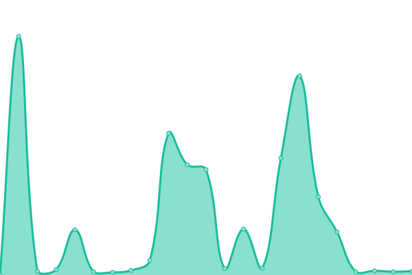
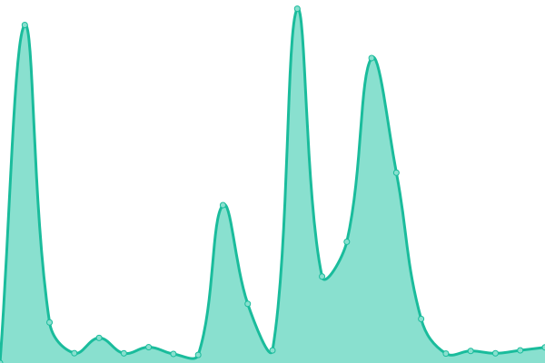

# [📈 Live Status](https://upptime.github.io/upptime): <!--live status--> **🟩 All systems operational**

<!--start: status pages-->
<!-- This summary is generated by Upptime (https://github.com/upptime/upptime) -->
<!-- Do not edit this manually, your changes will be overwritten -->
<!-- prettier-ignore -->
| URL | Status | History | Response Time | Uptime |
| --- | ------ | ------- | ------------- | ------ |
|  [joelee.works](https://joelee.works) | 🟩 Up | [joelee-works.yml](https://github.com/iamsurgee/uptime/commits/HEAD/history/joelee-works.yml) | 

 344ms
     
 | 

<a href="https://iamsurgee.github.io/uptime/history/joelee-works">100.00%</a>
    

|  [Github Player](https://music.joelee.works) | 🟩 Up | [github-player.yml](https://github.com/iamsurgee/uptime/commits/HEAD/history/github-player.yml) | 

 150ms
     
 | 

<a href="https://iamsurgee.github.io/uptime/history/github-player">100.00%</a>
    

|  [Jet Brawley](https://cruelajarevents--leecheeyong.repl.co/) | 🟩 Up | [jet-brawley.yml](https://github.com/iamsurgee/uptime/commits/HEAD/history/jet-brawley.yml) | 

 2950ms
     
 | 

<a href="https://iamsurgee.github.io/uptime/history/jet-brawley">95.39%</a>
    

|  [Music](https://music.is-a.dev) | 🟩 Up | [music.yml](https://github.com/iamsurgee/uptime/commits/HEAD/history/music.yml) | 

 1842ms
     
 | 

<a href="https://iamsurgee.github.io/uptime/history/music">99.57%</a>
    

|  [One Time Msg](https://onemsg.js.org/) | 🟩 Up | [one-time-msg.yml](https://github.com/iamsurgee/uptime/commits/HEAD/history/one-time-msg.yml) | 

 2108ms
     
 | 

<a href="https://iamsurgee.github.io/uptime/history/one-time-msg">99.06%</a>
    

|  [GeoIP](https://geoip.bsyou.repl.co/) | 🟩 Up | [geo-ip.yml](https://github.com/iamsurgee/uptime/commits/HEAD/history/geo-ip.yml) | 

 3890ms
     
 | 

<a href="https://iamsurgee.github.io/uptime/history/geo-ip">98.46%</a>
    

|  [Terminal Bot](https://terminal.bsyou.repl.co/) | 🟩 Up | [terminal-bot.yml](https://github.com/iamsurgee/uptime/commits/HEAD/history/terminal-bot.yml) | 

 1265ms
     
 | 

<a href="https://iamsurgee.github.io/uptime/history/terminal-bot">98.36%</a>
    

|  [Joe Bot](https://oddballnuttynumericalanalysis--cjyou.repl.co/) | 🟩 Up | [joe-bot.yml](https://github.com/iamsurgee/uptime/commits/HEAD/history/joe-bot.yml) | 

 2306ms
     
 | 

<a href="https://iamsurgee.github.io/uptime/history/joe-bot">98.34%</a>
    

|  [Garden API](https://garden.is-a.dev) | 🟩 Up | [garden-api.yml](https://github.com/iamsurgee/uptime/commits/HEAD/history/garden-api.yml) | 

 1300ms
     
 | 

<a href="https://iamsurgee.github.io/uptime/history/garden-api">100.00%</a>
    

|  [NewsPool](https://newspool.js.org) | 🟩 Up | [news-pool.yml](https://github.com/iamsurgee/uptime/commits/HEAD/history/news-pool.yml) | 

 2194ms
     
 | 

<a href="https://iamsurgee.github.io/uptime/history/news-pool">98.93%</a>
    

|  [Linky](https://UnrealisticGrimVolcano-1.redirector.repl.co) | 🟩 Up | [linky.yml](https://github.com/iamsurgee/uptime/commits/HEAD/history/linky.yml) | 

 8587ms
     
 | 

<a href="https://iamsurgee.github.io/uptime/history/linky">94.42%</a>
    

|  [Shortem](https://short.is-a.dev) | 🟩 Up | [shortem.yml](https://github.com/iamsurgee/uptime/commits/HEAD/history/shortem.yml) | 

 3701ms
     
 | 

<a href="https://iamsurgee.github.io/uptime/history/shortem">98.74%</a>
    

|  [Hello](https://hello.is-a.dev) | 🟩 Up | [hello.yml](https://github.com/iamsurgee/uptime/commits/HEAD/history/hello.yml) | 

 4094ms
     
 | 

<a href="https://iamsurgee.github.io/uptime/history/hello">99.14%</a>
    

|  [Inky](https://ink.is-a.dev/test) | 🟩 Up | [inky.yml](https://github.com/iamsurgee/uptime/commits/HEAD/history/inky.yml) | 

 1245ms
     
 | 

<a href="https://iamsurgee.github.io/uptime/history/inky">97.62%</a>
    

|  [Status](https://UnsteadyBitterPoints.noiceapi.repl.co) | 🟩 Up | [status.yml](https://github.com/iamsurgee/uptime/commits/HEAD/history/status.yml) | 

 3147ms
     
 | 

<a href="https://iamsurgee.github.io/uptime/history/status">51.03%</a>
    

|  [Uptime](https://rudedarkbluehacks.modm.repl.co/) | 🟩 Up | [uptime.yml](https://github.com/iamsurgee/uptime/commits/HEAD/history/uptime.yml) | 

 201ms
     
 | 

<a href="https://iamsurgee.github.io/uptime/history/uptime">98.18%</a>
    

|  [Modmail](https://profitablecoordinatedmacroinstruction.modm.repl.co/) | 🟩 Up | [modmail.yml](https://github.com/iamsurgee/uptime/commits/HEAD/history/modmail.yml) | 

 2441ms
     
 | 

<a href="https://iamsurgee.github.io/uptime/history/modmail">98.17%</a>
    

|  [Note](https://NiceSubduedDevices.modm.repl.co) | 🟩 Up | [note.yml](https://github.com/iamsurgee/uptime/commits/HEAD/history/note.yml) | 

 4457ms
     
 | 

<a href="https://iamsurgee.github.io/uptime/history/note">98.23%</a>
    

|  [NewsPool Bot](https://newspool-bot.craigcodes.repl.co) | 🟩 Up | [news-pool-bot.yml](https://github.com/iamsurgee/uptime/commits/HEAD/history/news-pool-bot.yml) | 

 3246ms
     
 | 

<a href="https://iamsurgee.github.io/uptime/history/news-pool-bot">98.18%</a>
    

|  [Badminton](https://badminton.leecheeyong.repl.co) | 🟩 Up | [badminton.yml](https://github.com/iamsurgee/uptime/commits/HEAD/history/badminton.yml) | 

 5430ms
     
 | 

<a href="https://iamsurgee.github.io/uptime/history/badminton">86.31%</a>
    

|  [Test Project](https://badminton.teambrawley.repl.co) | 🟩 Up | [test-project.yml](https://github.com/iamsurgee/uptime/commits/HEAD/history/test-project.yml) | 

 3314ms
     
 | 

<a href="https://iamsurgee.github.io/uptime/history/test-project">99.01%</a>
    

<!--end: status pages-->

[**Visit our status website →**](https://upptime.github.io/upptime)
