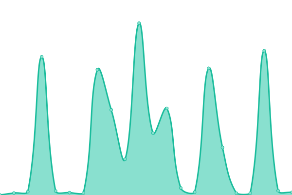

# [📈 Live Status](https://upptime.github.io/upptime): <!--live status--> **🟧 Partial outage**

<!--start: status pages-->
<!-- This summary is generated by Upptime (https://github.com/upptime/upptime) -->
<!-- Do not edit this manually, your changes will be overwritten -->
<!-- prettier-ignore -->
| URL | Status | History | Response Time | Uptime |
| --- | ------ | ------- | ------------- | ------ |
|  [joelee.works](https://joelee.works) | 🟩 Up | [joelee-works.yml](https://github.com/iamsurgee/uptime/commits/HEAD/history/joelee-works.yml) | 

 339ms
     
 | 

<a href="https://iamsurgee.github.io/uptime/history/joelee-works">100.00%</a>
    

|  [Github Player](https://music.joelee.works) | 🟩 Up | [github-player.yml](https://github.com/iamsurgee/uptime/commits/HEAD/history/github-player.yml) | 

 218ms
     
 | 

<a href="https://iamsurgee.github.io/uptime/history/github-player">100.00%</a>
    

|  [Brawley](https://cruelajarevents--leecheeyong.repl.co/) | 🟩 Up | [brawley.yml](https://github.com/iamsurgee/uptime/commits/HEAD/history/brawley.yml) | 

 1076ms
     
 | 

<a href="https://iamsurgee.github.io/uptime/history/brawley">99.91%</a>
    

|  [Music](https://music.is-a.dev) | 🟩 Up | [music.yml](https://github.com/iamsurgee/uptime/commits/HEAD/history/music.yml) | 

 1500ms
     
 | 

<a href="https://iamsurgee.github.io/uptime/history/music">99.79%</a>
    

|  [One Time Msg](https://onemsg.js.org/) | 🟥 Down | [one-time-msg.yml](https://github.com/iamsurgee/uptime/commits/HEAD/history/one-time-msg.yml) | 

 1914ms
     
 | 

<a href="https://iamsurgee.github.io/uptime/history/one-time-msg">99.73%</a>
    

|  [GeoIP](https://geoip.bsyou.repl.co/) | 🟥 Down | [geo-ip.yml](https://github.com/iamsurgee/uptime/commits/HEAD/history/geo-ip.yml) | 

 1329ms
     
 | 

<a href="https://iamsurgee.github.io/uptime/history/geo-ip">99.74%</a>
    

|  [Terminal Bot](https://terminal.bsyou.repl.co/) | 🟥 Down | [terminal-bot.yml](https://github.com/iamsurgee/uptime/commits/HEAD/history/terminal-bot.yml) | 

 1479ms
     
 | 

<a href="https://iamsurgee.github.io/uptime/history/terminal-bot">99.75%</a>
    

|  [Joe Bot](https://oddballnuttynumericalanalysis--cjyou.repl.co/) | 🟥 Down | [joe-bot.yml](https://github.com/iamsurgee/uptime/commits/HEAD/history/joe-bot.yml) | 

 1748ms
     
 | 

<a href="https://iamsurgee.github.io/uptime/history/joe-bot">99.76%</a>
    

|  [Garden API](https://garden.is-a.dev) | 🟥 Down | [garden-api.yml](https://github.com/iamsurgee/uptime/commits/HEAD/history/garden-api.yml) | 

 1470ms
     
 | 

<a href="https://iamsurgee.github.io/uptime/history/garden-api">99.77%</a>
    

|  [Garden API - Tags](https://garden.is-a.dev/v2/tags) | 🟥 Down | [garden-api-tags.yml](https://github.com/iamsurgee/uptime/commits/HEAD/history/garden-api-tags.yml) | 

 765ms
     
 | 

<a href="https://iamsurgee.github.io/uptime/history/garden-api-tags">99.94%</a>
    

|  [NewsPool](https://newspool.js.org) | 🟩 Up | [news-pool.yml](https://github.com/iamsurgee/uptime/commits/HEAD/history/news-pool.yml) | 

 507ms
     
 | 

<a href="https://iamsurgee.github.io/uptime/history/news-pool">100.00%</a>
    

|  [Linky](https://UnrealisticGrimVolcano-1.redirector.repl.co) | 🟥 Down | [linky.yml](https://github.com/iamsurgee/uptime/commits/HEAD/history/linky.yml) | 

 2095ms
     
 | 

<a href="https://iamsurgee.github.io/uptime/history/linky">99.12%</a>
    

|  [Shortem](https://short.is-a.dev) | 🟥 Down | [shortem.yml](https://github.com/iamsurgee/uptime/commits/HEAD/history/shortem.yml) | 

 373ms
     
 | 

<a href="https://iamsurgee.github.io/uptime/history/shortem">99.52%</a>
    

|  [Hello](https://hello.is-a.dev) | 🟩 Up | [hello.yml](https://github.com/iamsurgee/uptime/commits/HEAD/history/hello.yml) | 

 253ms
     
 | 

<a href="https://iamsurgee.github.io/uptime/history/hello">100.00%</a>
    

|  [Inky](https://ink.is-a.dev/test) | 🟥 Down | [inky.yml](https://github.com/iamsurgee/uptime/commits/HEAD/history/inky.yml) | 

 295ms
     
 | 

<a href="https://iamsurgee.github.io/uptime/history/inky">99.96%</a>
    

|  [Status](https://UnsteadyBitterPoints.noiceapi.repl.co) | 🟩 Up | [status.yml](https://github.com/iamsurgee/uptime/commits/HEAD/history/status.yml) | 

 1403ms
     
 | 

<a href="https://iamsurgee.github.io/uptime/history/status">96.97%</a>
    

|  [Uptime](https://rudedarkbluehacks.modm.repl.co/) | 🟩 Up | [uptime.yml](https://github.com/iamsurgee/uptime/commits/HEAD/history/uptime.yml) | 

 256ms
     
 | 

<a href="https://iamsurgee.github.io/uptime/history/uptime">100.00%</a>
    

|  [Modmail](https://profitablecoordinatedmacroinstruction.modm.repl.co/) | 🟩 Up | [modmail.yml](https://github.com/iamsurgee/uptime/commits/HEAD/history/modmail.yml) | 

 349ms
     
 | 

<a href="https://iamsurgee.github.io/uptime/history/modmail">100.00%</a>
    

|  [Note](https://NiceSubduedDevices.modm.repl.co) | 🟥 Down | [note.yml](https://github.com/iamsurgee/uptime/commits/HEAD/history/note.yml) | 

 293ms
     
 | 

<a href="https://iamsurgee.github.io/uptime/history/note">99.98%</a>
    

|  [NewsPool Bot](https://newspool-bot.craigcodes.repl.co) | 🟥 Down | [news-pool-bot.yml](https://github.com/iamsurgee/uptime/commits/HEAD/history/news-pool-bot.yml) | 

 328ms
     
 | 

<a href="https://iamsurgee.github.io/uptime/history/news-pool-bot">99.99%</a>
    

|  [Badminton](https://badminton.leecheeyong.repl.co) | 🟥 Down | [badminton.yml](https://github.com/iamsurgee/uptime/commits/HEAD/history/badminton.yml) | 

 324ms
     
 | 

<a href="https://iamsurgee.github.io/uptime/history/badminton">99.99%</a>
    

|  [Test Project](https://badminton.teambrawley.repl.co) | 🟩 Up | [test-project.yml](https://github.com/iamsurgee/uptime/commits/HEAD/history/test-project.yml) | 

 1350ms
     
 | 

<a href="https://iamsurgee.github.io/uptime/history/test-project">100.00%</a>
    

|  [Surge](https://i-am.surge.sh) | 🟩 Up | [surge.yml](https://github.com/iamsurgee/uptime/commits/HEAD/history/surge.yml) | 

 939ms
     
 | 

<a href="https://iamsurgee.github.io/uptime/history/surge">100.00%</a>
    

|  [Brawley](https://CruelAjarEvents-v14.leecheeyong.repl.co) | 🟩 Up | [brawley.yml](https://github.com/iamsurgee/uptime/commits/HEAD/history/brawley.yml) | 

 1076ms
     
 | 

<a href="https://iamsurgee.github.io/uptime/history/brawley">99.91%</a>
    

<!--end: status pages-->

[**Visit our status website →**](https://upptime.github.io/upptime)
